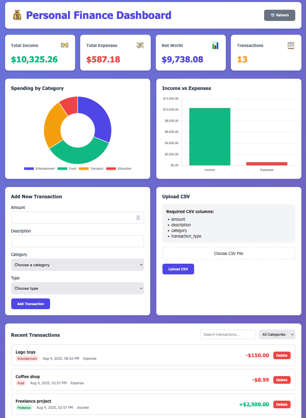

# Getting Started

Steps to get up and running with `finance-dashboard`.

1. Clone this repository:

```shell
git clone https://gitlab.com/7-11/rnd/frictionless/forward-five/finance-dashboard.git
```

2. If you don't have UV, [install it](https://github.com/astral-sh/uv).

3. Go to the directory and run `uv sync`:

```shell
cd finance-dashboard
uv sync
```
4. Run the ASGI server:

```shell
uv run python -m findash
```
5. Open a browser and paste the following url:

```shell
http://127.0.0.1:8000/static/index.html
```
6. A dashboard should appear:


